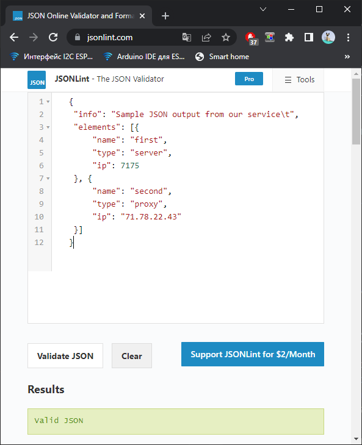

# Домашнее задание к занятию "4.3. Языки разметки JSON и YAML"


## Обязательная задача 1
Мы выгрузили JSON, который получили через API запрос к нашему сервису:
```
    { "info" : "Sample JSON output from our service\t",
        "elements" :[
            { "name" : "first",
            "type" : "server",
            "ip" : 7175 
            }
            { "name" : "second",
            "type" : "proxy",
            "ip : 71.78.22.43
            }
        ]
    }
```
  Нужно найти и исправить все ошибки, которые допускает наш сервис


## Обязательная задача 2
В прошлый рабочий день мы создавали скрипт, позволяющий опрашивать веб-сервисы и получать их IP. К уже реализованному функционалу нам нужно добавить возможность записи JSON и YAML файлов, описывающих наши сервисы. Формат записи JSON по одному сервису: `{ "имя сервиса" : "его IP"}`. Формат записи YAML по одному сервису: `- имя сервиса: его IP`. Если в момент исполнения скрипта меняется IP у сервиса - он должен так же поменяться в yml и json файле.

### Ваш скрипт:
```python
import socket, time
import json
import yaml


def ip_ch(name_service):
    try:
        return socket.gethostbyname(name_service)
    except Exception as error:
        return ("Error connect " + str(error))


def save_json(s_d):
    try:
        with open(next(iter(s_d)) + "data_file.json", "w") as write_file:
            json.dump(s_d, write_file)
    except Exception as error:
        print("Error save json " + str(error))


def save_yaml(s_d):
    try:
        with open(next(iter(s_d)) + "data_file.yaml", "w") as file:
            yaml.dump([s_d], file)
    except Exception as error:
        print("Error save yaml " + str(error))


def load_json(s_d):
    try:
        with open(s_d + "data_file.json", "r") as load_file:
            lj = json.load(load_file)
            return lj[s_d]
    except Exception as error:
        print("Error load json " + str(error))
        return 0


name_service = ['drive.google.com', 'mail.google.com', 'google.com']
a_dict = {key: load_json(key) for key in name_service}
for c in a_dict.keys():
    print(c, a_dict[c])

a = 0
while a < 10:
    for c in a_dict.keys():
        d = {}
        d[c] = ip_ch(c)
        ld = load_json(c)
        if ld != d[c]:
            save_json(d)
            save_yaml(d)
            print('[ERROR] ' + c + ' mismatch: ' + ld + ' ' + d[c])
    time.sleep(60)
```

### Вывод скрипта при запуске при тестировании:
```
drive.google.com 173.194.222.194
mail.google.com 173.194.220.19
google.com 173.194.73.138
[ERROR] drive.google.com mismatch: 74.125.205.194 173.194.222.194
[ERROR] mail.google.com mismatch: 142.250.150.19 173.194.220.19
[ERROR] google.com mismatch: 142.251.1.102 173.194.73.138
```

### json-файл(ы), который(е) записал ваш скрипт:
```json
drive.google.comdata_file.json
{"drive.google.com": "173.194.222.194"}
google.comdata_file.json
{"google.com": "173.194.73.138"}
mail.google.comdata_file.json
{"mail.google.com": "173.194.220.19"}
```

### yml-файл(ы), который(е) записал ваш скрипт:
```yaml
drive.google.comdata_file.yaml
- drive.google.com: 173.194.222.194
google.comdata_file.yaml
- google.com: 173.194.73.138
mail.google.comdata_file.yaml
- mail.google.com: 173.194.220.19
```
